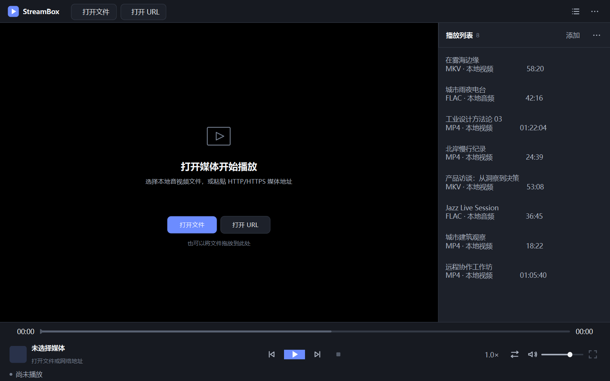

# StreamBox

StreamBox 是一个使用 C++17、Qt Widgets 与 FFmpeg 实现的桌面音视频播放器。界面依据仓库中的产品需求、设计规范和 HTML 原型开发，播放链路直接调用 FFmpeg 解封装、解码与滤镜 API，不嵌入网页播放器。

> 当前状态：功能开发与验收阶段。Windows + Qt 6.11 + MinGW 13.1 x64 是目前实际构建和测试过的环境；120 分钟稳定性测试及部分真实网络异常场景的验收状态以 [`ACCEPTANCE_TEST_REPORT.md`](ACCEPTANCE_TEST_REPORT.md) 为准。



## 功能

- 打开本地音频、视频文件，或 HTTP/HTTPS 媒体 URL
- 播放、暂停、停止、进度跳转、音量调节与静音
- 上一项、下一项以及顺序播放、列表循环、单曲循环
- 0.5×～2.0× 保调倍速播放
- 音频主时钟驱动的音视频同步与视频帧延迟/丢帧策略
- 视频窗口播放、保持宽高比缩放和全屏播放
- 全屏控制栏在 3 秒无鼠标移动后自动隐藏
- 播放列表添加、删除、清空、显示与隐藏
- 文件拖放、网络连接重试、不可跳转媒体识别
- 通过 Qt `QAudioSink` 输出到系统默认音频设备

## 已验证的媒体格式

格式是否可播放最终取决于媒体封装、编码参数以及本地 FFmpeg 构建。当前自动化媒体探针已实际获得下列格式的解码输出：

| 类型 | 已验证格式 |
|---|---|
| 音频 | PCM/WAV、MP3、FLAC、Vorbis/OGG、Opus/OGG |
| 视频/容器 | H.264/AAC MP4、MKV、MOV、WebM、AVI |
| 网络输入 | 本地测试服务器上的 HTTP 媒体；公网 HTTPS 已验证连接与取消流程 |

HEVC、VP9、AV1、MPEG-TS 尚未纳入当前 V1 验收矩阵。HLS、RTSP、RTMP 属于 PRD 中的 V1.1 范围，README 不将其列为现有功能。

## 技术实现

| 组成 | 当前实现 |
|---|---|
| 用户界面 | Qt 6 Widgets |
| 语言与构建 | C++17、CMake 3.21+、Ninja |
| 媒体处理 | FFmpeg 8.1.2：`avformat`、`avcodec`、`avfilter`、`avutil`、`swscale`、`swresample` |
| 音频 | FFmpeg `atempo`/`aformat` 输出 48 kHz、S16、双声道 PCM，再交给 Qt `QAudioSink` |
| 视频 | FFmpeg 解码后由 `swscale` 转换为 BGRA，由 Qt 绘制 |
| 并发 | `DecoderWorker` 在线程中完成打开、读取、解码和帧转换，避免阻塞界面线程 |
| 同步 | 音频 PTS 为主时钟，视频根据时间差等待或丢帧 |

更完整的播放链路和状态说明见 [`ARCHITECTURE.md`](ARCHITECTURE.md)。

## 环境要求

当前仓库中的构建脚本使用 Windows 路径并面向 MinGW，已验证环境如下：

- Windows
- Qt 6.11.0 MinGW 64-bit；CMake 最低要求为 Qt 6.5
- MinGW 13.1 x64
- CMake 3.21+
- Ninja
- MSYS2，用于编译 FFmpeg
- FFmpeg 8.1.2 源码

Qt、MSYS2、FFmpeg 源码、FFmpeg SDK 和构建产物不提交到仓库。它们分别由本机环境提供或生成到已忽略的目录。

## 准备 FFmpeg SDK

项目默认从 `D:\ffmpeg-8.1.2\ffmpeg-8.1.2` 读取 FFmpeg 8.1.2 源码。路径不同时，通过环境变量指定：

```powershell
$env:STREAMBOX_FFMPEG_SOURCE='D:\path\to\ffmpeg-8.1.2'
& '.\scripts\build_ffmpeg_mingw.ps1'
```

脚本使用仓库本地 `.tooling\msys64` 中的 MSYS2，并把生成的 SDK 放入 `third_party\ffmpeg-sdk`。这两个目录均不纳入版本控制。

## 使用 Qt Creator 构建

1. 启动 `D:\Qt\Tools\QtCreator\bin\qtcreator.exe`。
2. 选择“打开项目”，打开仓库根目录的 `CMakeLists.txt`。
3. 选择 `Desktop Qt 6.11.0 MinGW 64-bit` Kit，或兼容的 Qt 6.5+ MinGW Kit。
4. 确认 `third_party\ffmpeg-sdk` 已生成。
5. 配置、构建并运行目标 `StreamBox`。

如果 SDK 位于其他位置，可在 CMake 配置中设置 `FFMPEG_ROOT`。

## 命令行构建

下面的命令对应本项目已经验证的本机 Qt 安装路径：

```powershell
& 'D:\Qt\Tools\CMake_64\bin\cmake.exe' -S . -B build -G Ninja `
  -DCMAKE_PREFIX_PATH='D:\Qt\6.11.0\mingw_64' `
  -DCMAKE_CXX_COMPILER='D:\Qt\Tools\mingw1310_64\bin\g++.exe' `
  -DCMAKE_MAKE_PROGRAM='D:\Qt\Tools\Ninja\ninja.exe'

& 'D:\Qt\Tools\CMake_64\bin\cmake.exe' --build build --parallel
```

构建完成后运行：

```powershell
& '.\build\StreamBox.exe'
```

也可以使用开发验收参数直接打开媒体：

```powershell
& '.\build\StreamBox.exe' --open 'D:\media\sample.mp4' --speed 1.5
```

`--seek` 的单位为毫秒；`--fullscreen`、`--quit-after`、`--screenshot` 和 `--screenshot-delay` 主要用于自动化验收。

## 快捷键

| 快捷键 | 操作 |
|---|---|
| `Ctrl+O` | 打开本地文件 |
| `Ctrl+U` | 打开网络 URL |
| `Space` | 播放/暂停 |
| `P` / `N` | 上一项/下一项 |
| `←` / `→` | 后退/前进 5 秒 |
| `↑` / `↓` | 音量增加/降低 5% |
| `M` | 静音/取消静音 |
| `F` | 进入或退出全屏 |
| `Esc` | 退出全屏 |

## 测试

配置构建时默认启用 CTest。运行自动化测试：

```powershell
& 'D:\Qt\Tools\CMake_64\bin\ctest.exe' --test-dir build --output-on-failure
```

当前测试覆盖 FFmpeg SDK 链接与运行时加载、播放策略、音视频解码、倍速、暂停/恢复、跳转、HTTP 输入、失败连接取消，以及连续 100 次媒体切换。格式探针和长时间测试的命令见 [`TESTING.md`](TESTING.md)，逐项结果见 [`ACCEPTANCE_TEST_REPORT.md`](ACCEPTANCE_TEST_REPORT.md)。

真实音频测试已确认 Qt 选择物理的 `耳机 (Realtek(R) Audio)` 默认端点，音频接收器无错误并由用户确认可以听到测试音。该结果只代表完成测试时的设备与系统配置。

## Windows 部署

```powershell
& '.\scripts\deploy_windows.ps1'
```

脚本先构建应用，再复制 StreamBox、FFmpeg 动态库及 Qt 运行库，输出到 `dist\StreamBox`。脚本中的 Qt 与 FFmpeg 路径是当前验证环境的本机路径；在其他安装位置使用前需要调整脚本。

## 当前限制

- 尚未实现字幕、音轨选择、硬件解码、播放历史或断点续播。
- 公网 HTTPS 连续播放质量受当前网络和服务器行为影响；现有自动化测试使用可控的本地 HTTP 服务。
- 物理网卡断开/恢复仍属于人工验收项目。
- 当前只验证了 Windows MinGW 构建；代码使用跨平台库不等于其他操作系统已经完成适配和测试。
- 仓库当前没有 `LICENSE` 文件。在许可证明确之前，公开可见不代表已经授予复制、修改或再分发许可。

## 项目文档

- [`PRD_OnlineMediaPlayer.md`](PRD_OnlineMediaPlayer.md)：产品需求
- [`DESIGN_OnlineMediaPlayer.md`](DESIGN_OnlineMediaPlayer.md)：界面与交互规范
- [`ARCHITECTURE.md`](ARCHITECTURE.md)：播放内核架构
- [`TESTING.md`](TESTING.md)：测试方法
- [`ACCEPTANCE_TEST_REPORT.md`](ACCEPTANCE_TEST_REPORT.md)：当前验收结果
- [`TECH_STACK_AUDIT.md`](TECH_STACK_AUDIT.md)：工具链与依赖核验
- [`THIRD_PARTY_NOTICES.md`](THIRD_PARTY_NOTICES.md)：第三方组件说明

## 致谢与参考

README 的信息组织参考了 [mpv](https://github.com/mpv-player/mpv) 与 [QtAVPlayer](https://github.com/valbok/QtAVPlayer) 等音视频项目；StreamBox 没有因此宣称具备这些项目的全部功能。播放器依赖 [Qt](https://www.qt.io/) 和 [FFmpeg](https://ffmpeg.org/)，具体第三方许可信息见 [`THIRD_PARTY_NOTICES.md`](THIRD_PARTY_NOTICES.md)。
